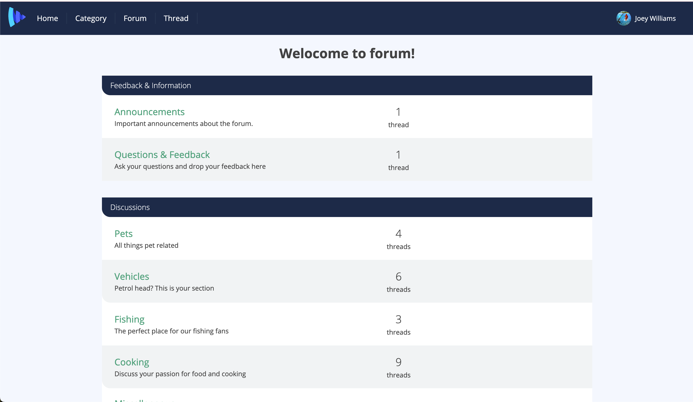

# vue-forum

## Project setup
### snapshot
 


```
npm install
```

### Compiles and hot-reloads for development
```
npm run serve
```

### Compiles and minifies for production
```
npm run build
```

### Lints and fixes files
```
npm run lint
```


# better commit message format

```
<type>(<scope>): <short summary>
  │       │             │
  │       │             └─⫸ Summary in present tense. Not capitalized. No period at the end.
  │       │
  │       └─⫸ Commit Scope: categories | forums | threads | posts | user_profile |
  │                          
  │                          
  │                          
  │                          
  │
  └─⫸ Commit Type: build|ci|docs|feat|fix|perf|refactor|test|chore|wip(work in progress)|revert
```


